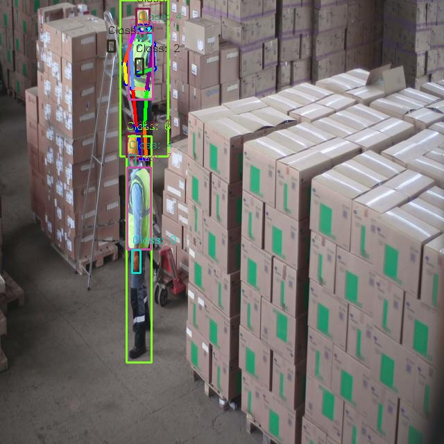
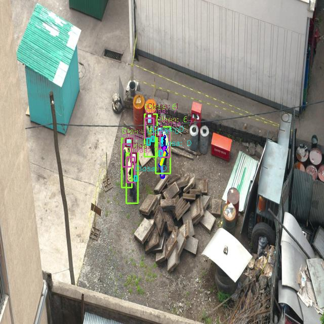
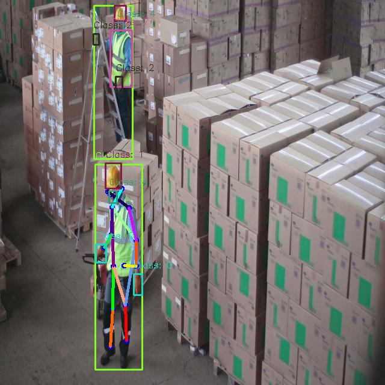
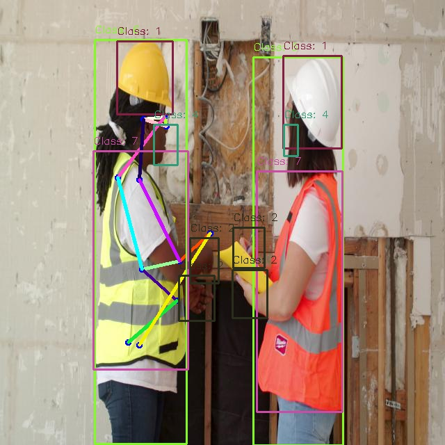

# README.md
**For All Work on Internship Period**


## YOLOV8
In This Part Try to Benchmark between Small model and Nano model with Variety Method e.g. Detection, Pose Estimate, Tracking

## Dependency Installation
**main dependency in this project**
```
pip install ultralytics
```

**All Dependency contain in requirement.txt can install follow this**
```
pip3 install -r requirements.txt
```

**Note** All package Install via ultralytics package for more info: [Ultralytics Github](https://github.com/ultralytics/ultralytics)

## Benchmark GPU, CPU, Time Execution

### **Detection**


---
### **Detection + Tracking**


---
### **Pose Estimate**


---
### **Pose Estimate + Tracking**


---

## Demo VDO

### **Nano Model**

| **Task**  |**VDO** |
| --------- | --------- |
| **Detection**    |         |
| **Detection + Tracking**    |         |
| **Pose Estimate**    |         |
| **Pose Estimate + Tracking**    |         |
---


### **Small Model**

| **Task**  |**VDO**|
| --------- | --------------- |
| **Detection**    |         |
| **Detection + Tracking**    |         |
| **Pose Estimate**    |         |
| **Pose Estimate + Tracking**    |         |


## Multi Class Pose-Detection

### Utility script for label Pose Annotation

**Usage**
```
python3 path/to/script/label_annotated.py --model path/to/model --images_dir path/to/images_dir --label_dir path/to/label_dir --kpt_length number/of/keypoints --class_selected number/of/class/wanted/label --show_img
```
**Parameter**

|**Parameter**|**Usage**|
| --------- | --------------- |
|model|Path to your model (Defualt: yolov8n-pose)|
|images_dir|Path to your image directory|
|label_dir|Path to you label directory|
|kpt_length|Number of keypoints you have (Defualt: 17 keypoints of human)|
|class_selected|Class you want to label it |

---
### Example Image from Utility Scripts


   

--- 
## Example Inference with multi Class Pose-Detection


