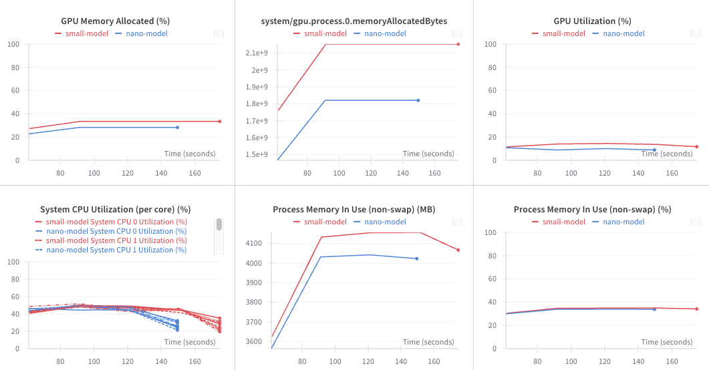
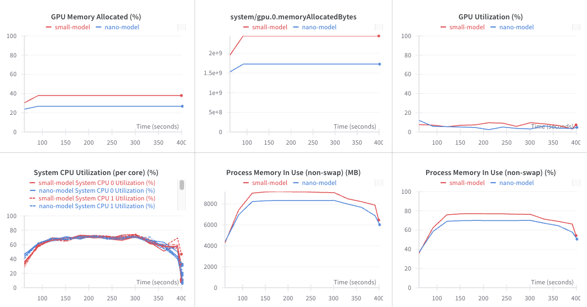
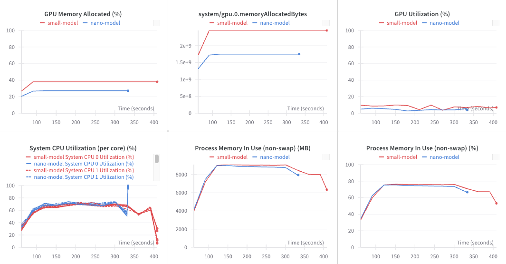

# README.md
**For All Work on Internship Period**

## YOLOV8
In This Part Try to Benchmark between Small model and Nano model with Variety Method e.g. Detection, Pose Estimate, Tracking

## Benchmark GPU, CPU, Time Execution

### **Detection**

---
### **Detection + Tracking**

---
### **Pose Estimate**

---
### **Pose Estimate + Tracking**

---

## Demo VDO

### **Nano Model**

| **Task**  |**VDO** |
| --------- | --------- |
| **Detection**    |         |
| **Detection + Tracking**    |         |
| **Pose Estimate**    |         |
| **Pose Estimate + Tracking**    |         |
---

### **Small Model**

| **Task**  |**VDO**|
| --------- | --------------- |
| **Detection**    |         |
| **Detection + Tracking**    |         |
| **Pose Estimate**    |         |
| **Pose Estimate + Tracking**    |         |
